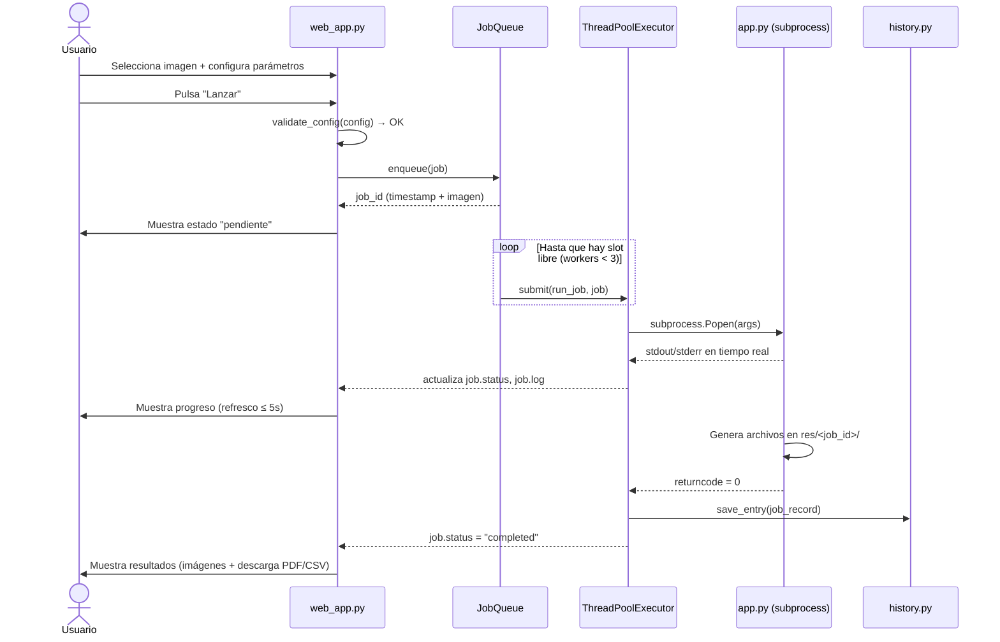

# Documento de Diseño Técnico — `web-ui`

## Visión general

`web-ui` es una aplicación Streamlit que expone el generador de kits "Pintar por Números" (`app.py`) a través de una interfaz gráfica web. Permite subir imágenes desde un volumen montado, configurar todos los parámetros del generador con controles visuales, lanzar hasta 3 ejecuciones en paralelo mediante una cola interna, consultar el historial persistente de ejecuciones y comparar resultados visualmente.

La aplicación se distribuye como contenedor Docker. El checkpoint SAM, el directorio de imágenes de entrada y el directorio de resultados se montan como volúmenes externos para evitar incluir datos pesados en la imagen.

---

## Arquitectura

### Diagrama de componentes

```mermaid
graph TD
    subgraph Docker Container
        WA[web_app.py\nStreamlit UI]
        JR[job_runner.py\nJobQueue + ThreadPoolExecutor]
        CS[config_schema.py\nPARAM_SCHEMA + COLOR_PROFILES]
        HI[history.py\nHistorial JSON]
        ST[styles.css\nGlassmorphism dark mode]
    end

    subgraph Volúmenes externos
        SAM[/data/sam_vit_b_01ec64.pth]
        IN[/data/in/  ← imágenes]
        RES[/data/res/ ← resultados]
    end

    subgraph Proceso hijo
        APP[app.py\nCLI generador]
    end

    WA -->|lee esquema| CS
    WA -->|encola jobs| JR
    WA -->|lee/escribe historial| HI
    WA -->|inyecta CSS| ST
    JR -->|subprocess| APP
    APP -->|lee| SAM
    APP -->|lee| IN
    APP -->|escribe| RES
    HI -->|persiste en| RES
```

### Diagrama de flujo de una ejecución



---

## Componentes e interfaces

### `config_schema.py`

Extrae `PARAM_SCHEMA` y `COLOR_PROFILES` de `run_interactive.py` sin modificar ese archivo. Añade la función de validación y construcción de argumentos.

```python
# Tipos exportados
PARAM_SCHEMA: list[dict]       # igual que en run_interactive.py
COLOR_PROFILES: list[dict]     # igual que en run_interactive.py

def default_config() -> dict:
    """Devuelve un dict {key: default} para todos los parámetros del esquema."""

def apply_color_profile(config: dict, profile_key: str) -> dict:
    """
    Aplica un perfil de color a la config.
    Actualiza k_min, k_max, colors y auto_k según el perfil.
    Devuelve la config modificada (no muta el original).
    """

def validate_config(config: dict) -> list[str]:
    """
    Valida todos los parámetros de config contra PARAM_SCHEMA.
    Devuelve lista de mensajes de error (vacía si todo es válido).
    Cada mensaje incluye el nombre del parámetro y el rango permitido.
    """

def build_args(
    image_path: str,
    output_dir: str,
    checkpoint: str,
    config: dict,
) -> list[str]:
    """
    Construye la lista de argumentos para subprocess (sys.executable + app.py + flags).
    Equivalente a build_args de run_interactive.py.
    """
```

### `history.py`

Gestiona la lectura y escritura del historial JSON en `res/history.json`.

```python
from dataclasses import dataclass, field
from typing import Optional
import json
from pathlib import Path

@dataclass
class ExecutionRecord:
    job_id: str                  # "<timestamp_iso>_<image_stem>"
    image_name: str              # nombre del archivo de imagen
    config: dict                 # copia completa de la Configuración
    status: str                  # "pending" | "running" | "completed" | "error"
    started_at: str              # ISO 8601
    duration_s: Optional[float]  # segundos, None si no terminó
    output_dir: str              # ruta al directorio de resultados
    error_msg: Optional[str]     # mensaje de error si status == "error"

def load_history(history_path: Path) -> list[ExecutionRecord]:
    """
    Lee el historial desde history_path.
    Devuelve lista ordenada por started_at descendente.
    Si el archivo no existe, devuelve lista vacía.
    """

def save_entry(history_path: Path, record: ExecutionRecord) -> None:
    """
    Añade o actualiza un registro en el historial.
    Crea el archivo si no existe.
    Operación atómica: escribe en fichero temporal y renombra.
    """

def get_history(history_path: Path) -> list[ExecutionRecord]:
    """
    Alias de load_history. Devuelve la lista ordenada por started_at desc.
    """
```

### `job_runner.py`

Gestiona la cola de ejecuciones y el pool de threads.

```python
import queue
import threading
from concurrent.futures import ThreadPoolExecutor
from dataclasses import dataclass, field
from typing import Callable, Optional
import subprocess
import time

MAX_WORKERS = 3

@dataclass
class Job:
    job_id: str
    args: list[str]              # argumentos para subprocess
    status: str = "pending"      # "pending" | "running" | "completed" | "error"
    log: str = ""                # stdout + stderr capturado
    returncode: Optional[int] = None
    started_at: Optional[float] = None
    finished_at: Optional[float] = None

class JobQueue:
    """
    Cola de ejecuciones con ThreadPoolExecutor(max_workers=3).
    Thread-safe: usa threading.Lock para acceso a _jobs.
    """

    def __init__(self, on_complete: Callable[[Job], None]):
        """
        on_complete: callback invocado cuando un job termina (éxito o error).
        Se llama desde el thread del worker, no desde el thread principal.
        """

    def enqueue(self, job: Job) -> str:
        """
        Añade job a la cola y lo envía al executor si hay slot libre.
        Devuelve job.job_id.
        """

    def get_jobs(self) -> list[Job]:
        """Devuelve copia de la lista de todos los jobs (cualquier estado)."""

    def active_count(self) -> int:
        """Número de jobs con status == 'running'."""

    def shutdown(self) -> None:
        """Espera a que terminen los workers activos y cierra el executor."""
```

### `web_app.py`

Punto de entrada Streamlit. Orquesta todos los componentes.

```python
# Funciones principales (no son la API pública, sino la estructura interna)

def load_env_config() -> dict:
    """
    Lee SAM_CHECKPOINT_PATH, INPUT_DIR, OUTPUT_DIR, PORT desde variables de entorno.
    Aplica valores por defecto si no están definidas.
    """

def scan_images(input_dir: Path) -> list[Path]:
    """
    Escanea input_dir en busca de archivos con SUPPORTED_EXTENSIONS.
    Devuelve lista ordenada alfabéticamente (case-insensitive).
    """

def render_config_panel(config: dict) -> dict:
    """
    Renderiza el Panel_Configuración con todos los controles de PARAM_SCHEMA.
    Devuelve la config actualizada con los valores actuales de los controles.
    """

def render_jobs_panel(queue: JobQueue) -> None:
    """Renderiza la lista de ejecuciones activas con su estado y log."""

def render_history_panel(history_path: Path) -> Optional[ExecutionRecord]:
    """
    Renderiza el Panel_Historial.
    Devuelve el registro seleccionado por el usuario (o None).
    """

def render_comparison_panel(
    record_a: ExecutionRecord,
    record_b: ExecutionRecord,
) -> None:
    """Renderiza el Panel_Comparación con las imágenes y metadatos de ambas ejecuciones."""

def results_exist(output_dir: str) -> bool:
    """
    Devuelve True si los 3 archivos de imagen del Resultado existen en output_dir.
    No muestra resultados hasta que esta función devuelve True.
    """
```

---

## Modelo de datos

### Registro de historial (`res/history.json`)

El historial es un array JSON de objetos con la siguiente estructura:

```json
[
  {
    "job_id": "20240115_143205_frida02",
    "image_name": "frida02.jpg",
    "config": {
      "color_profile": "lapices24",
      "profile": "a4",
      "orientation": "landscape",
      "auto_k": true,
      "colors": 14,
      "k_min": 10,
      "k_max": 16,
      "target_ssim": 0.965,
      "slic_n": 4000,
      "slic_compact": 8.0,
      "edge_deltaE": 3.5,
      "smooth_open": 0,
      "smooth_close": 1,
      "min_region_area": 30,
      "sam_device": "cpu",
      "sam_pps": 32,
      "sam_min_area": 400,
      "sam_iou": 0.90,
      "sam_stability": 0.93,
      "line_thickness": 1,
      "force_closed": true,
      "close_gaps_radius": 1,
      "font_size": 14,
      "numbers_min_area": 20
    },
    "k_result": 14,
    "status": "completed",
    "started_at": "2024-01-15T14:32:05Z",
    "duration_s": 187.4,
    "output_dir": "/data/res/frida02__k14_pps32_dE35_slic4000_lapices24__20240115_143205",
    "error_msg": null
  }
]
```

### Campos obligatorios de `ExecutionRecord`

| Campo | Tipo | Descripción |
|---|---|---|
| `job_id` | `str` | `<YYYYMMDD_HHMMSS>_<image_stem>` — único por ejecución |
| `image_name` | `str` | Nombre del archivo de imagen (con extensión) |
| `config` | `dict` | Copia completa de todos los parámetros + `color_profile` |
| `k_result` | `int` | Número de colores real usado (post Auto-K) |
| `status` | `str` | `"pending"` \| `"running"` \| `"completed"` \| `"error"` |
| `started_at` | `str` | Timestamp ISO 8601 del inicio del encolado |
| `duration_s` | `float \| null` | Duración en segundos; `null` si no terminó |
| `output_dir` | `str` | Path con parámetros clave codificados en camelCase |
| `error_msg` | `str \| null` | Mensaje de error; `null` si no hubo error |

### Work path por ejecución — convención de nombres

Cada ejecución genera su propio directorio de trabajo dentro de `OUTPUT_DIR`. El nombre del directorio codifica los parámetros clave en camelCase para que sea legible e identificable sin abrir el historial:

```
<OUTPUT_DIR>/
└── <imageStem>__k<K>_pps<PPS>_dE<DELTAE>_slic<SLICN>_<PROFILE>__<YYYYMMDD_HHMMSS>/
    ├── 01_outline_numbered.png
    ├── 02_colored_reference.png
    ├── 03_palette.png
    ├── color_by_numbers_kit.pdf
    └── palette.csv
```

**Parámetros incluidos en el nombre del directorio:**

| Segmento | Parámetro | Ejemplo |
|---|---|---|
| `<imageStem>` | nombre del archivo sin extensión | `frida02` |
| `k<K>` | número de colores resultante (post Auto-K) | `k14` |
| `pps<PPS>` | SAM puntos por lado | `pps32` |
| `dE<DELTAE>` | umbral ΔE (sin punto decimal, multiplicado x10) | `dE35` |
| `slic<SLICN>` | número de segmentos SLIC | `slic4000` |
| `<PROFILE>` | clave del perfil de color | `lapices24` |
| `<YYYYMMDD_HHMMSS>` | timestamp de inicio | `20240115_143205` |

**Ejemplo completo:**
```
res/frida02__k14_pps32_dE35_slic4000_lapices24__20240115_143205/
```

**Función que genera el path:**

```python
def make_output_dir(
    output_base: Path,
    image_stem: str,
    config: dict,
    k_result: int,
    started_at: datetime,
) -> Path:
    """
    Construye y crea el directorio de trabajo para una ejecución.

    El nombre codifica los parámetros clave en camelCase:
      <imageStem>__k<K>_pps<PPS>_dE<DELTAE*10>_slic<SLICN>_<profile>__<YYYYMMDD_HHMMSS>

    - k_result: número de colores final (puede diferir de k_max si Auto-K está activo)
    - deltaE se multiplica x10 y se redondea para evitar puntos en el nombre
    - profile usa la clave del COLOR_PROFILES (ej. "lapices24", "pixelArtRetro")
    - El directorio se crea antes de devolver el Path

    Devuelve el Path absoluto al directorio creado.
    """
    dE_int = round(config["edge_deltaE"] * 10)
    profile = config.get("color_profile", "manual")
    ts = started_at.strftime("%Y%m%d_%H%M%S")
    name = (
        f"{image_stem}"
        f"__k{k_result}"
        f"_pps{config['sam_pps']}"
        f"_dE{dE_int}"
        f"_slic{config['slic_n']}"
        f"_{profile}"
        f"__{ts}"
    )
    path = output_base / name
    path.mkdir(parents=True, exist_ok=True)
    return path
```

> **Nota:** `k_result` se conoce solo después de que `app.py` ejecuta Auto-K. El directorio se crea justo antes de lanzar el subprocess, usando `k_max` como estimación inicial si Auto-K está activo, y se renombra al finalizar si el valor real difiere. Si el renombrado falla (ej. por permisos), se mantiene el nombre original y se registra el `k_result` real en el historial.

### Archivos de resultado por ejecución

```
<output_dir>/
├── 01_outline_numbered.png   # Outline con números
├── 02_colored_reference.png  # Referencia coloreada
├── 03_palette.png            # Imagen de paleta
├── color_by_numbers_kit.pdf  # PDF completo
└── palette.csv               # Paleta en CSV
```

---

## Propiedades de corrección

*Una propiedad es una característica o comportamiento que debe ser verdadero en todas las ejecuciones válidas del sistema — esencialmente, una declaración formal sobre lo que el sistema debe hacer. Las propiedades sirven como puente entre las especificaciones legibles por humanos y las garantías de corrección verificables por máquina.*

### Propiedad 1: Scan de imágenes filtra por extensión

*Para cualquier* directorio con una combinación arbitraria de archivos con extensiones soportadas (`.jpg`, `.jpeg`, `.png`, `.webp`, `.bmp`) y no soportadas, `scan_images` debe devolver exactamente los archivos con extensiones soportadas, sin incluir ningún archivo con extensión no soportada.

**Validates: Requirements 2.1**

### Propiedad 2: Scan de imágenes devuelve lista ordenada

*Para cualquier* conjunto de archivos con extensiones soportadas en un directorio, `scan_images` debe devolver la lista ordenada alfabéticamente por nombre de archivo (insensible a mayúsculas).

**Validates: Requirements 2.2**

### Propiedad 3: Completitud de parámetros en build_args

*Para cualquier* configuración válida generada a partir de `default_config()`, `build_args` debe incluir en la lista de argumentos resultante un flag o valor correspondiente a cada parámetro de `PARAM_SCHEMA` que sea relevante para la ejecución.

**Validates: Requirements 3.1**

### Propiedad 4: Aplicación de perfil de color actualiza campos correctos

*Para cualquier* perfil en `COLOR_PROFILES` (excepto `"manual"`), `apply_color_profile` debe actualizar `k_min`, `k_max`, `colors` y `auto_k` con exactamente los valores del perfil, sin modificar ningún otro campo de la configuración.

**Validates: Requirements 3.5**

### Propiedad 5: La cola nunca supera 3 workers simultáneos

*Para cualquier* secuencia de N ejecuciones encoladas (N ≥ 1), el número de jobs con `status == "running"` en `JobQueue` nunca debe superar `MAX_WORKERS = 3` en ningún momento durante el procesamiento.

**Validates: Requirements 4.2**

### Propiedad 6: Unicidad de identificadores de ejecución

*Para cualquier* par de ejecuciones encoladas con distinta combinación de timestamp e imagen, sus `job_id` deben ser distintos. No pueden existir dos registros con el mismo `job_id` en la cola ni en el historial.

**Validates: Requirements 4.7**

### Propiedad 7: Round-trip de serialización del historial

*Para cualquier* `ExecutionRecord` con valores arbitrarios en todos sus campos, serializar el registro a JSON con `save_entry` y deserializarlo con `load_history` debe producir un registro con valores idénticos en todos los campos.

**Validates: Requirements 6.1, 6.2**

### Propiedad 8: Historial ordenado por timestamp descendente

*Para cualquier* lista de registros con timestamps distintos guardados en el historial, `get_history` debe devolver la lista ordenada por `started_at` de más reciente a más antiguo.

**Validates: Requirements 6.3**

### Propiedad 9: Reutilización de configuración preserva todos los parámetros

*Para cualquier* `ExecutionRecord` guardado en el historial, la configuración extraída del registro debe contener exactamente las mismas claves y valores que la configuración original que se pasó al crear el registro.

**Validates: Requirements 6.5**

### Propiedad 10: Validación rechaza parámetros fuera de rango

*Para cualquier* configuración que contenga al menos un parámetro con valor fuera del rango `[min, max]` definido en `PARAM_SCHEMA`, `validate_config` debe devolver una lista no vacía de errores que incluya el nombre del parámetro inválido y el rango permitido.

**Validates: Requirements 9.1, 9.2**

### Propiedad 11: Validación acepta configuraciones válidas

*Para cualquier* configuración donde todos los parámetros están dentro de sus rangos definidos en `PARAM_SCHEMA` y tienen tipos correctos, `validate_config` debe devolver una lista vacía (sin errores).

**Validates: Requirements 9.1**

### Propiedad 12: Variables de entorno configuran rutas correctamente

*Para cualquier* valor de `SAM_CHECKPOINT_PATH`, `INPUT_DIR` u `OUTPUT_DIR` definido en el entorno, `load_env_config` debe devolver exactamente ese valor para la clave correspondiente, sin modificarlo.

**Validates: Requirements 8.2, 8.3, 8.4**

> **Reflexión de redundancia:** Las propiedades 10 y 11 son complementarias (no redundantes): la 10 verifica el rechazo de inválidos y la 11 verifica la aceptación de válidos. La propiedad 7 (round-trip JSON) subsume la verificación de persistencia de 6.2, por lo que no se añade una propiedad separada para persistencia. Las propiedades 1 y 2 son independientes: filtrado y ordenación son invariantes distintas.

---

## Manejo de errores

### Errores de configuración de entorno

| Situación | Comportamiento |
|---|---|
| `SAM_CHECKPOINT_PATH` no existe en disco | Aviso visible en la UI al iniciar; las ejecuciones se encolan pero fallan al intentar ejecutar `app.py` |
| `INPUT_DIR` no existe o está vacío | Mensaje informativo en el Panel_Configuración; botón "Lanzar" deshabilitado |
| `OUTPUT_DIR` no tiene permisos de escritura | Error capturado en el log del job; status → `"error"` |

### Errores de validación de parámetros

- `validate_config` devuelve mensajes descriptivos antes de encolar.
- La UI muestra los mensajes con `st.error()` y no encola el job.
- Los sliders de Streamlit ya limitan el rango, pero `validate_config` actúa como segunda línea de defensa (especialmente para valores pasados programáticamente).

### Errores de ejecución de `app.py`

- El subprocess se ejecuta con `stdout=PIPE, stderr=STDOUT` para capturar toda la salida.
- Si `returncode != 0`, el job pasa a `status = "error"` y `error_msg` contiene las últimas líneas del log.
- El registro se guarda en el historial con `status = "error"` para trazabilidad.

### Errores de historial

- `save_entry` usa escritura atómica (fichero temporal + rename) para evitar corrupción en caso de interrupción.
- Si el archivo `history.json` está corrupto al leer, `load_history` registra el error en el log de la app y devuelve lista vacía (no falla la aplicación).

### Errores de concurrencia

- `JobQueue` usa `threading.Lock` para todas las operaciones sobre `_jobs`.
- El callback `on_complete` se invoca desde el thread del worker; las actualizaciones de estado de Streamlit se sincronizan mediante `st.session_state`.

---

## Estrategia de testing

### Enfoque dual

La estrategia combina tests unitarios con ejemplos concretos y tests basados en propiedades (PBT) con Hypothesis para verificar invariantes universales.

### Librería de PBT

**[Hypothesis](https://hypothesis.readthedocs.io/)** — librería de property-based testing para Python. Cada test de propiedad se ejecuta con un mínimo de 100 iteraciones con entradas generadas aleatoriamente.

### Tests de propiedad (Hypothesis)

Cada test referencia la propiedad del diseño con el tag:
`# Feature: web-ui, Property N: <texto de la propiedad>`

| Test | Propiedad | Módulo |
|---|---|---|
| `test_scan_images_filters_extensions` | Propiedad 1 | `test_config_schema.py` |
| `test_scan_images_sorted` | Propiedad 2 | `test_config_schema.py` |
| `test_build_args_completeness` | Propiedad 3 | `test_config_schema.py` |
| `test_apply_color_profile` | Propiedad 4 | `test_config_schema.py` |
| `test_queue_max_workers` | Propiedad 5 | `test_job_runner.py` |
| `test_job_id_uniqueness` | Propiedad 6 | `test_job_runner.py` |
| `test_history_round_trip` | Propiedad 7 | `test_history.py` |
| `test_history_sorted_desc` | Propiedad 8 | `test_history.py` |
| `test_config_reuse_preserves_params` | Propiedad 9 | `test_history.py` |
| `test_validate_config_rejects_invalid` | Propiedad 10 | `test_config_schema.py` |
| `test_validate_config_accepts_valid` | Propiedad 11 | `test_config_schema.py` |
| `test_env_config_reads_vars` | Propiedad 12 | `test_web_app.py` |

### Tests unitarios con ejemplos

- `test_default_config_has_all_keys`: verifica que `default_config()` contiene todas las claves de `PARAM_SCHEMA`.
- `test_job_status_transitions`: verifica las transiciones `pending → running → completed/error` con mocks de subprocess.
- `test_results_exist_false_when_missing`: verifica que `results_exist` devuelve `False` cuando faltan archivos.
- `test_results_exist_true_when_present`: verifica que `results_exist` devuelve `True` cuando los 3 archivos existen.
- `test_validate_config_no_image`: verifica el mensaje de error cuando no hay imagen seleccionada.
- `test_history_empty_on_missing_file`: verifica que `load_history` devuelve `[]` si el archivo no existe.
- `test_history_atomic_write`: verifica que una interrupción simulada no corrompe el historial existente.

### Tests de smoke (manuales / CI)

- Verificar que el Dockerfile construye sin errores.
- Verificar que `docker-compose up` arranca la app en el puerto configurado.
- Verificar que el CSS inyectado contiene `backdrop-filter` y colores oscuros.

### Configuración de Hypothesis

```python
# conftest.py
from hypothesis import settings, HealthCheck

settings.register_profile("ci", max_examples=200, suppress_health_check=[HealthCheck.too_slow])
settings.register_profile("dev", max_examples=50)
settings.load_profile("ci")  # en CI; "dev" en desarrollo local
```
